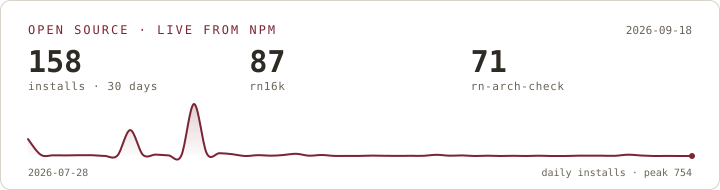

<h1 align="center">Mishal Ibrar</h1>

<p align="center">
  <b>Mobile &amp; Web Developer</b> — React Native apps, the Next.js platforms behind them,<br/>
  and the Node · MongoDB · Postgres services that keep both honest.
</p>

<p align="center">
  <a href="https://portfolio-mishal.vercel.app/"></a>
  <a href="https://www.linkedin.com/in/mishalibrar/"></a>
  <a href="https://www.npmjs.com/~mishalibrar"></a>
  <a href="mailto:mishalibrar12@gmail.com"></a>
</p>

---

Full-stack product developer at **Hello World Technologies**, shipping since March 2024 across
fitness, healthcare, automotive and wellness. I build the whole round trip — the app people
install, the dashboard the team runs it from, the API and database underneath — because owning
both ends means fewer meetings about whose side the bug is on.

### What I'm doing right now

- 🏗️ Building multi-tenant healthcare and fitness platforms — Next.js + React Native from one codebase
- 📦 Maintaining [`rn16k`](https://www.npmjs.com/package/rn16k) and [`rn-arch-check`](https://www.npmjs.com/package/rn-arch-check), CLIs that catch Android 15 and New Architecture breakage before the store does
- 🎓 Teaching cross-platform mobile development at IT Centre Rahim Yar Khan
- 💬 Ask me about React Native's New Architecture, Android's 16 KB page size requirement, or EAS release plumbing

<br/>

## 📱 Shipped to the stores

<table>
<tr>
<td width="50%" valign="top">

### Bravo Life
**Self-development & habit-building app** · ⭐ 4.9 on the App Store

A short daily loop — curated actions, a belief card, a journal prompt, a streak to protect,
a community feed of wins. Firebase carries auth and analytics, Cloud Functions schedule
timezone-aware reminders, and CodePush ships fixes the day they land instead of after review.

`React Native` `TypeScript` `Firebase` `Cloud Functions` `IAP` `CodePush`

[App Store](https://apps.apple.com/us/app/the-bravo-life-delulu-sprint/id6749274123) · [Google Play](https://play.google.com/store/apps/details?id=com.thebravolifeapp)

</td>
<td width="50%" valign="top">

### LocumForce
**Healthcare locum staffing marketplace** · two-sided, one codebase

Locums find shifts, organisations fill them. Gemini ranks jobs and candidates, Socket.IO
carries the conversation, GPS check-in evidences attendance against the site, and Stripe
Connect pays each professional directly.

`React Native` `TypeScript` `Socket.IO` `Stripe Connect` `Gemini` `Maps` `OneSignal`

[App Store](https://apps.apple.com/de/app/locumforce/id6755456767?l=en-GB) · [Google Play](https://play.google.com/store/apps/details?id=com.locumforce)

</td>
</tr>
</table>

<br/>

## 📦 Open source

Both are zero-config, MIT, and built for the same reason: a React Native release requirement
that fails silently until Google Play rejects the upload.

| | What it does | Why it exists |
|---|---|---|
| [**rn16k**](https://github.com/mishalibrar/react-native-16kb-page-support-checker) <br/> <sub>[npm](https://www.npmjs.com/package/rn16k) · zero deps</sub> | Decides whether an Android build meets Android 15's **16 KB page size** requirement — ELF segment and APK ZIP alignment, no Android SDK needed. | It resolves the transitive Maven graph that `node_modules` never shows, then names the dependency that shipped the failing `.so`. |
| [**rn-arch-check**](https://github.com/mishalibrar/rn-arch-check) <br/> <sub>[npm](https://www.npmjs.com/package/rn-arch-check) · Expo + bare</sub> | Checks every dependency for **New Architecture** support (Fabric, TurboModules, JSI) against React Native Directory. | Sorts by what needs action, quotes npm deprecation notices the directory misses, and exits non-zero only on a confirmed break — so it can gate CI. |

<p align="center">
  <picture>
    <source media="(prefers-color-scheme: dark)" srcset="assets/installs-dark.svg">
    
  </picture>
</p>

<details>
<summary>Per-package detail — versions, all-time installs, last publish</summary>

<!-- STATS:START -->

| Package | Latest | Installs · 30 days | Installs · all time | Last publish |
| --- | --- | --: | --: | --- |
| [`rn16k`](https://www.npmjs.com/package/rn16k) | `1.2.3` | 954 | 954 | 2026-08-10 |
| [`rn-arch-check`](https://www.npmjs.com/package/rn-arch-check) | `0.1.4` | 725 | 725 | 2026-08-10 |

<sub>Live npm data — rewritten nightly by [`readme-stats.yml`](.github/workflows/readme-stats.yml). Last refresh 2026-08-24.</sub>

<!-- STATS:END -->

</details>

```bash
npx rn16k            # 16 KB page size audit
npx rn-arch-check    # New Architecture compatibility report
```

<br/>

## 🛠️ Platforms I've built

| Platform | What it is | Stack | |
|---|---|---|---|
| **BrightSmile** | Multi-tenant dental clinic platform — online booking, interactive odontograms, treatment planning across **5 user portals** with automated white-labeling and full tenant data isolation. | Next.js · React Native · Supabase · PostgreSQL · Stripe | [Live ↗](https://dentist.helloworldtech.com/) |
| **ApexGym** | Fitness coaching platform — **7,000+ exercise assets**, workout programming, client progress tracking and referral onboarding, synced across a web dashboard and mobile apps. | Next.js · React Native · Expo · TypeScript · Firebase | [Live ↗](https://fitness.helloworldtech.com/) |
| **ShineCrew** | Car wash operating system — location-based **QR booking**, real-time cleaner dispatch, Stripe payments and before/after job verification. | Next.js · React Native CLI · Node · Express · MongoDB · Stripe | [Live ↗](https://carwash.helloworldtech.com/) |
| **Smart Wellness Platform** | Enterprise wellness pod ecosystem — **4 connected platforms** covering IoT provisioning, biometric session scheduling and offline-first kiosk sync at ~50 ms device latency. | React Native · Next.js · Electron · Node · Redis · Socket.IO | — |

<br/>

## ⚙️ Stack

**Mobile** &nbsp;


**Web** &nbsp;


**Backend** &nbsp;


**Ship** &nbsp;


<br/>

## 💼 Experience

| Role | Where | When |
|---|---|---|
| **Full Stack Developer** | Hello World Technologies | Jun 2026 — Present |
| **Mobile App Instructor** | IT Centre Rahim Yar Khan | Mar 2025 — Present |
| **React Native Developer** | Hello World Technologies | Mar 2024 — Jun 2026 |
| **React Native Intern** | Hello World Technologies | Jan 2024 — Mar 2024 |

Promoted from mobile into full-stack product work: backend services, database schemas and
Next.js portals alongside ongoing React Native development. Teaching in parallel — course
material and mentoring from UI implementation through store deployment.

<br/>

## 📊 GitHub

<!-- CARDS:START -->
<!-- CARDS:END -->

<picture>
  <source media="(prefers-color-scheme: dark)" srcset="https://raw.githubusercontent.com/mishalibrar/mishalibrar/output/github-contribution-grid-snake-dark.svg">
  <source media="(prefers-color-scheme: light)" srcset="https://raw.githubusercontent.com/mishalibrar/mishalibrar/output/github-contribution-grid-snake.svg">
  
</picture>

<sub>This profile keeps itself current — see [`.github/workflows`](.github/workflows). The
install card and table are rendered nightly from live npm data, the snake is regenerated from
the contribution graph, the stats cards come from a self-hosted
[github-readme-stats](https://github.com/mishalibrar/github-readme-stats) instance that is
health-checked before it is embedded, and every link on this page is crawled weekly. Nothing
above is typed in by hand.</sub>

<br/>

## 📬 Open to work

Full-time, contract and freelance — React Native, Next.js, or full-stack product work end to end.
New builds, or existing codebases that need finishing.

**[mishalibrar12@gmail.com](mailto:mishalibrar12@gmail.com)** · **[Portfolio + CV ↗](https://portfolio-mishal.vercel.app/)** · **[LinkedIn ↗](https://www.linkedin.com/in/mishalibrar/)**
